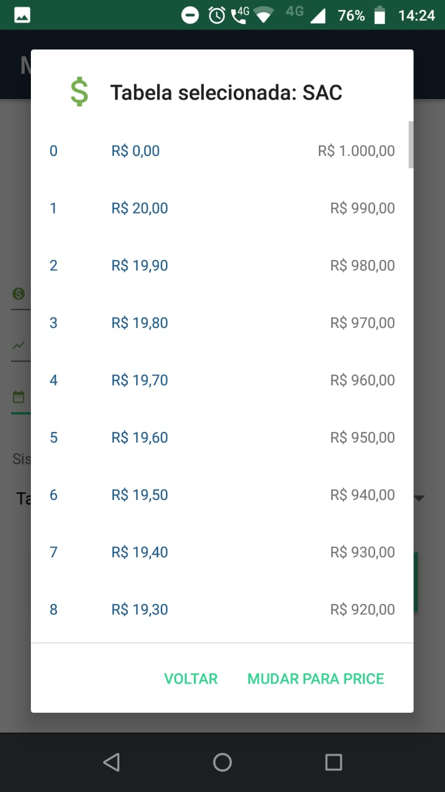

<!-- 

-->

# Minha Prestação

Aplicativo para realizar cálculos de financiamentos usando as tabelas de amortização SAC e Price para a disciplina
**Matemática Financeira** no curso Sistemas de Informação/UFRN.

## Desenvolvido com

* Java + Android Studio

## Colaboradores

* **Isaac José** - [isaacJose](https://github.com/isaacJose)
* **Vanderson Fabio** - [vandersonfabio](https://github.com/vandersonfabio)

